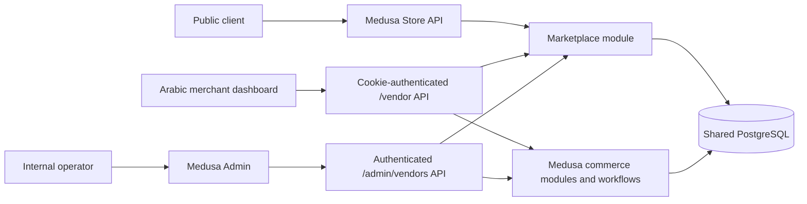

# Current Architecture

## Runtime topology

The repository is a modular monolith. There are no microservices and no
customer storefront application.

## Applications

### Medusa backend

`apps/backend` hosts Medusa 2.17.0, Medusa Admin, the custom marketplace
module, the vendor-product module link, and custom Admin, merchant, and public
Store routes.

### Merchant dashboard

`apps/vendor-dashboard` is a separate React/Vite application. It uses
`credentials: include` and calls only `/vendor` routes. Source inspection found
no global Admin credential, bearer token, local storage token, or `/admin` API
call. It is Arabic RTL first but currently has no English translation layer.

### Internal control surface

`apps/backend/src/admin/routes/settings/vendors/page.tsx` extends Medusa Admin
with vendor creation, editing, deletion, member status/password changes, domain
configuration, branding fields, and product assignment. This remains an
internal transitional tool, not the target platform dashboard.

## Database and commerce mapping

Observed runtime state:

| Resource | Count | Current mapping |
| --- | ---: | --- |
| Medusa store | 1 | Global backend store, not one per SaaS store. |
| Sales channel | 1 | Shared by current products. |
| Publishable API key | 1 | Shared Store API key. |
| Region | 1 | Shared commerce region. |
| Stock location | 1 | Shared location. |
| Vendor | 1 | Prototype store/tenant record. |
| Vendor member | 1 | Merchant account. |
| Vendor domain | 1 | Stored hostname mapping. |
| Vendor-product links | 3 | Application ownership relation. |

The current schema has no custom Tenant, SaaS Store, Plan, Entitlement,
WhatsApp Enquiry, Audit Event, or whole-order Store ownership entity.

## Trust boundaries

1. Public Store API: untrusted shopper input plus publishable key.
2. Merchant API: HMAC-signed HttpOnly cookie to active membership/store lookup.
3. Admin API: Medusa user authentication with session or bearer mechanism.
4. Commerce core: merchant routes invoke Medusa workflows server-side.
5. Shared database: all tenants would share tables; ownership checks are a
   security boundary.

## Existing controls

- Merchant store identity comes from the signed session, not request body.
- Active member and active vendor are rechecked on protected requests.
- Product PATCH checks the vendor-product link before mutation.
- Admin vendor routes require Medusa user authentication.
- Passwords use salted scrypt hashes and timing-safe comparison.
- Merchant cookie is HttpOnly, SameSite Lax, and Secure in production.
- Local `.env` is ignored by Git.

## Architectural gaps

- Vendor currently conflates tenant and store.
- One global sales channel, key, region, and stock location are not tenant
  isolation.
- Product creation assigns all sales channels.
- Order ownership is calculated from current product links rather than stored
  on the complete order.
- No authoritative store-context service cross-checks hostname, key, and
  channel.
- No permission policy uses merchant roles.
- No plan or entitlement service exists.
- No audit-log or request-ID layer exists.
- No Redis-backed event bus, workflow locking, or production worker topology is
  configured.

## Architecture decision: Vendor compatibility

Decision: **B as the target, implemented through C during migration**.

The target will introduce separate Tenant and SaaS Store entities because a
tenant may own multiple stores later. The current Vendor entity will remain
temporarily behind a compatibility service while records and API consumers are
backfilled. It will not be mass-renamed and it will not become the permanent
Tenant entity. This preserves current IDs and dashboard behavior while allowing
non-destructive migration in Phase 2.
