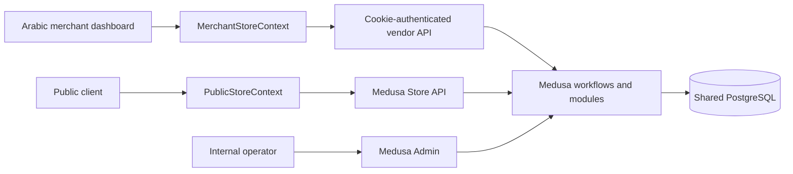

# Current Architecture

Last verified: 2026-07-13 after Phase 1 implementation.

## Runtime topology

The repository remains a modular monolith with a Medusa 2.17 backend and a separate React/Vite merchant dashboard. No customer storefront or provisioning engine was added in Phase 1.

## Verified current controls

- Protected merchant routes derive one active member and Vendor from the signed session, then resolve a strictly configured sales channel.
- Central owner/manager permissions guard product, order, profile, and self-security operations.
- Merchant product create/update uses Medusa workflows, one server-derived channel, and an exclusive vendor-product link.
- Public product routes require an active host Vendor whose configured channel matches the publishable key's only channel.
- Public profiles and merchant order responses are explicit allowlists.
- Order list/detail includes only line items belonging to the current merchant and returns 404 when none remain.
- Domain normalization removes case, scheme, path, port, `www`, and trailing dots before comparison.

## Temporary compatibility architecture

Vendor currently stands in for one Store. Sales channel and publishable-key references remain in Vendor metadata. Product ownership remains a module link. Order visibility is inferred from current product ownership. These are Phase 1 compatibility controls, not the permanent SaaS data model.

## Permanent target

Phase 2 must introduce separate Tenant and SaaS Store entities, memberships, verified domain records, data-backed channel/key ownership, and immutable Store ownership for carts and orders. Vendor compatibility must be migrated non-destructively.

## Deferred risks

- Whole-order Store ownership is not stored.
- Domain verification and approval workflow are not modeled.
- No plan, entitlement, provisioning, audit-event, or WhatsApp enquiry entity exists.
- The login rate limiter, event bus, and locking provider are process-local.
- Trusted proxy configuration is deployment-owned.
- Previously exposed Neon credential rotation is still unverified.